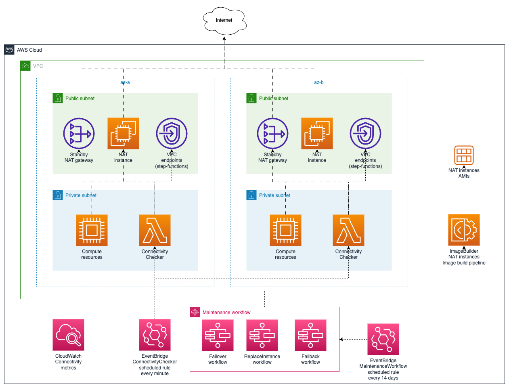
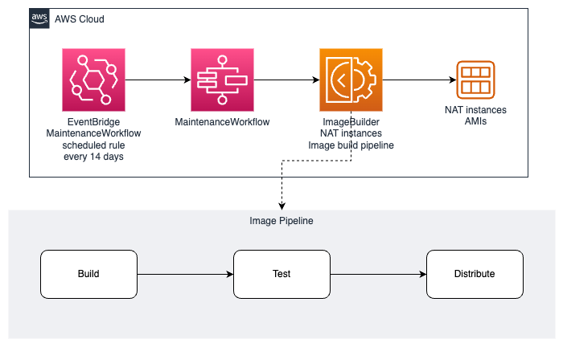
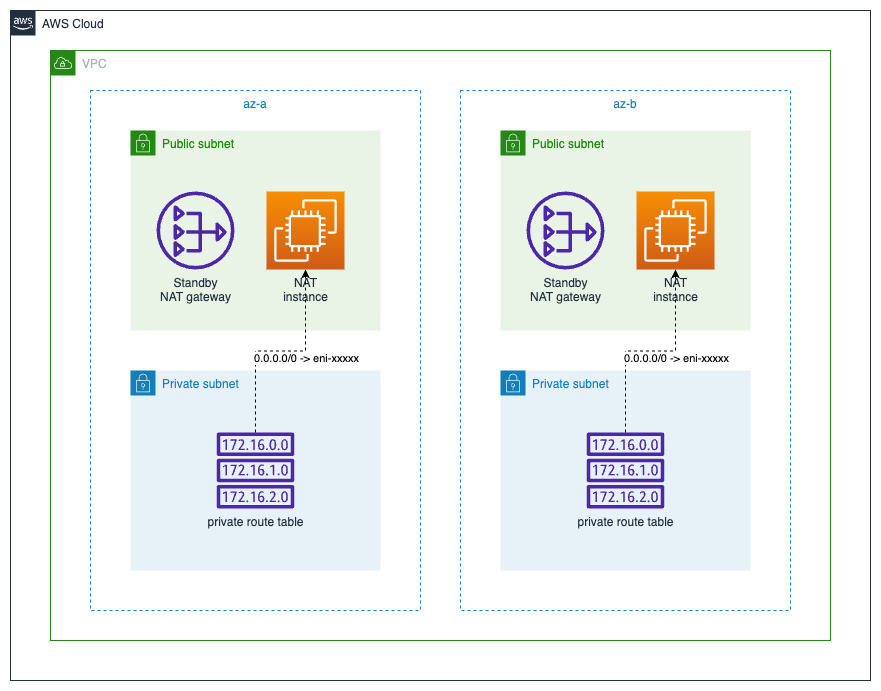
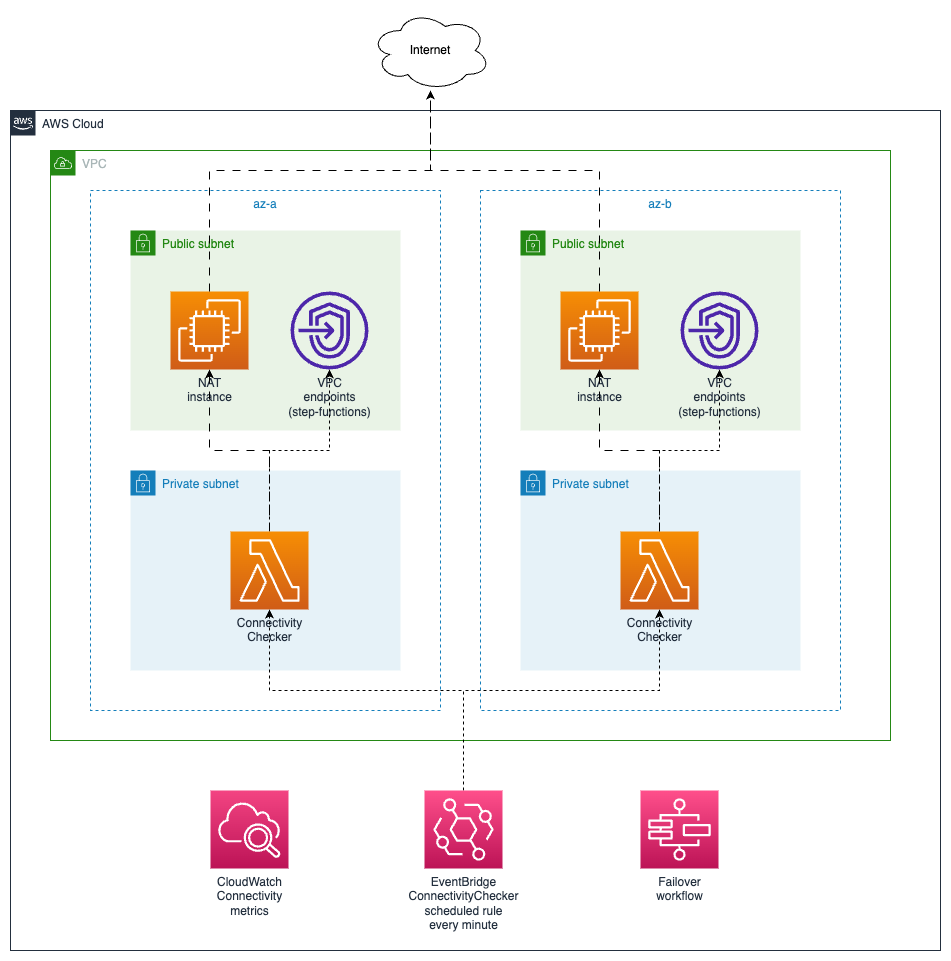
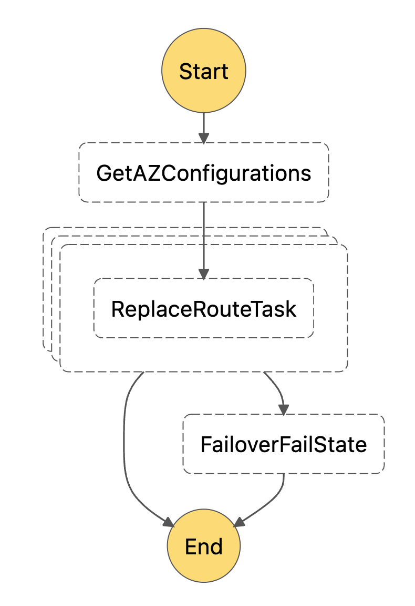
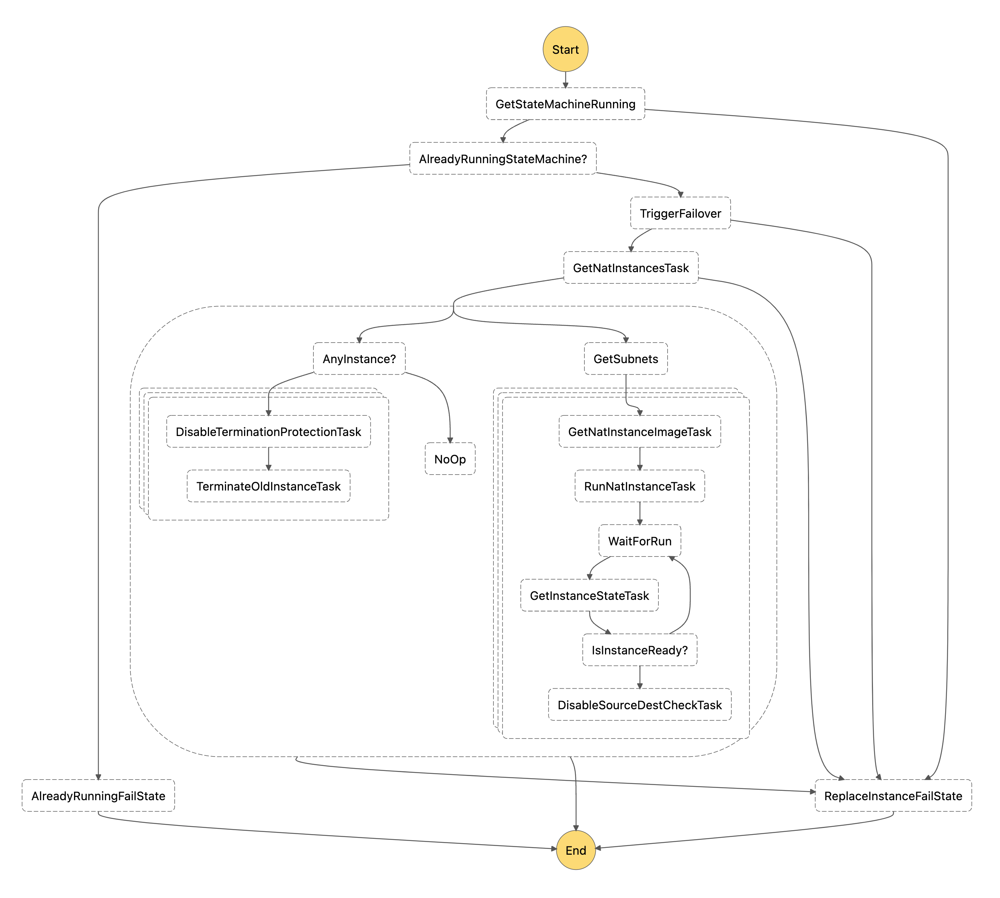
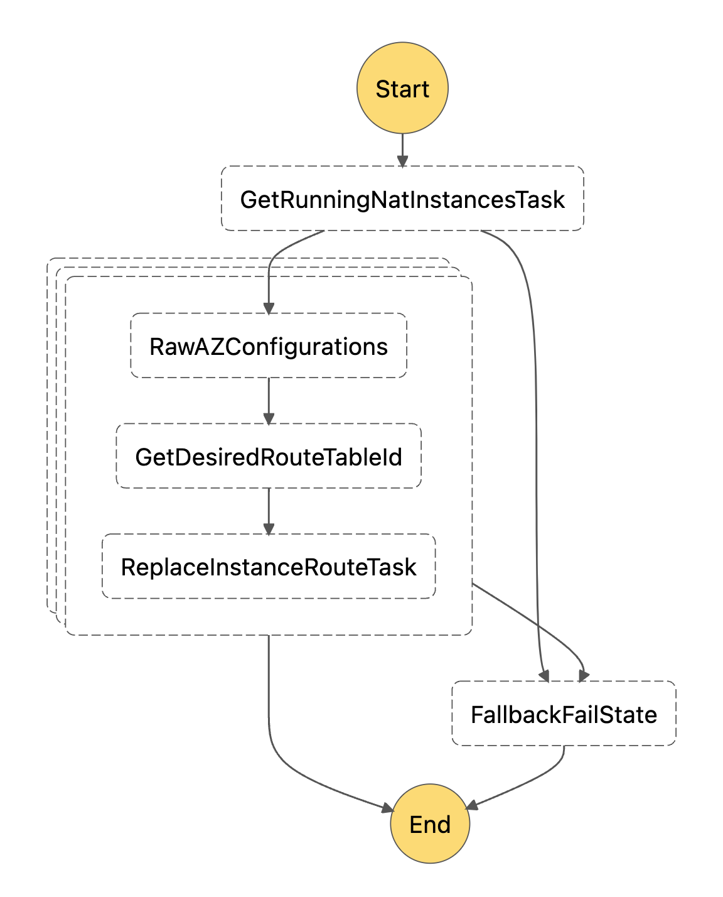
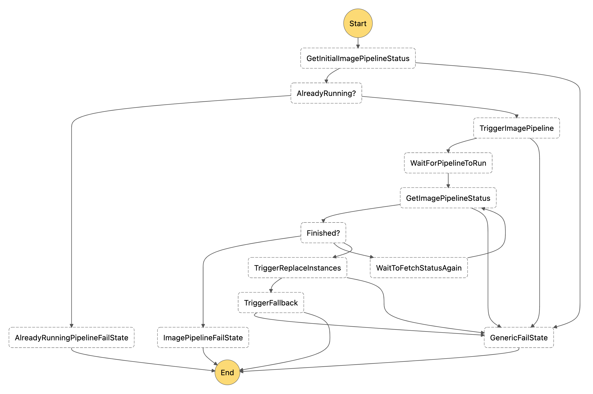

# NAT instances

- [NAT instances](#nat-instances)
  - [Introduction](#introduction)
  - [High level design](#high-level-design)
  - [Detailed solution](#detailed-solution)
    - [NAT instances images pipeline](#nat-instances-images-pipeline)
    - [NAT running resources](#nat-running-resources)
    - [Connectivity checker](#connectivity-checker)
    - [Workflows](#workflows)
      - [Failover State Machine](#failover-state-machine)
      - [Replace instances State Machine](#replace-instances-state-machine)
      - [Fallback State Machine](#fallback-state-machine)
      - [Maintenance State Machine](#maintenance-state-machine)
  - [Future work](#future-work)
  - [References](#references)

This page contains details about how the NAT instances solution has been implemented, how it can be changed and how to operate it.

## Introduction

The presented NAT instances solution is intended to replace the usage of NAT Gateways mainly because of their cost, since you are charged by not only the NAT Gateway uptime, but also for every byte processed by it, both ingress and egress traffic, which can become an issue, because you are charged also for the ingress traffic, resulting in potential huge network billing amounts, specially for workloads that makes a lot of external requests.

NAT instances will allow compute resources in private subnets to access the internet the same way that NAT Gateways do, but in this case we have to manage them, their whole lifecycle, thus, creation, update, replacement in case of failure and scale if required.

NAT instances are placed in the public subnets and we use the private subnets route tables to route the traffic coming from private subnets through the NAT instances.

This is a solution to implement NAT instances in a reliable and secure way.

You can read more detailed information about NAT instances in the [AWS docs](https://docs.aws.amazon.com/vpc/latest/userguide/VPC_NAT_Instance.html).

## High level design

Here is a diagram with a high level solution design:

  

The solution design is based on the one shown in the post [How we reduced our AWS bill by seven figures](https://medium.com/life-at-chime/how-we-reduced-our-aws-bill-by-seven-figures-5144206399cb) but contains a few changes in terms of how the NAT instances are created and how they are replaced in case of failure or maintenance.

From a high level point of view the solution contains four clearly differentiated pieces:

- `NAT instances images pipeline` - how the NAT instances images are built and distributed
- `NAT running resources` - the NAT instances themselves running in the public subnets and configured to translate traffic to internet and at least one NAT Gateway as a standby backup resource
- `Connectivity Checker` - Lambda functions that checks connectivity in the affected private subnets; they trigger the Failover process in case of failure and also emit connectivity metrics
- `Workflows` - several State Machines to handle the lifecycle of the solution

## Detailed solution

With that high level vision of the solution now we are going to dig into the details of each piece.

### NAT instances images pipeline

  

We need a reliable way to produce NAT instances images and to update them accordingly in regular intervals. [AWS Image Builder](https://docs.aws.amazon.com/imagebuilder/latest/userguide/what-is-image-builder.html) is a service that does this pretty well, so we rely on it for this purpose.

The pipeline is triggered from one of the Maintenance workflow steps; we will see that in detail in the [Maintenance workflow](#maintenance-state-machine) section, and that workflow is also triggered on a scheduled basis every 14 days, so we ensure that new updated NAT instances images are produced every 14 days.

As depicted in the diagram, the pipeline has three main steps:

- **Build** - spins up an instance with the base image (we are using the latest Amazon Linux 2 for ARM) and applies all the build components:
  - `enable-nat` - the component that applies the required changes to configure the NAT instance
  - `harden-nat` - empty for now, but we will use it to apply any kind of hardening we believe is convenient
- **Test** - spins up a new instance with the temporary image created from previous step and applies all the test components:
  - `reboot-test-linux` - checks that the instance continues running after a reboot
  - `test-nat` - checks that the expected configuration produced by the `enable-nat` is in place
- **Distribute** - creates a final image applying all the distribution settings, including the copy of the image to other regions and AMIs tagging

As it is right now, the pipeline run takes approximately 30 minutes to complete.

The pipeline can be run manually from the AWS Image Builder console and is a completely isolated task that does not affect any of the others.

### NAT running resources

  

In this block we will be talking about the resources that effectively provide us the NAT translation for internet traffic of the compute resources in the private subnets.

Essentially, we will have a NAT instance per public subnet considering that we will have at least one public subnet per Availability Zone we are using and the same for the private subnets as the AWS best practices suggest.

Then we will also have at least one route table per private subnet where we will have one route for the internet traffic, thus `0.0.0.0/0 -> whatever` and that "whatever" will be the `eni` attached to each corresponding NAT instance for the AZ. That will produce any traffic trying to reach the internet to pass through the NAT instance before going out.

A part from the OS configurations in the NAT instance, the instance needs to have:

- [Source/Dest checks](https://docs.aws.amazon.com/vpc/latest/userguide/VPC_NAT_Instance.html#EIP_Disable_SrcDestCheck) disabled
- A public IP - either auto assigned by the subnet settings or an attached EIP

We will also have at least one NAT Gateway in a public subnet per VPC so we can temporarily failover traffic to it in case of NAT instances failure or when performing maintenance operations. The cost of that will be minimal, since NAT Gateways uptime cost is very low and they will not be processing traffic for a long time.

It is possible to use only one NAT instance (and/or one route table) per VPC as long as all the private internet routes are pointing to it, but for reliability reasons we will try to have one per AZ in production environments.

### Connectivity checker

  

In order to ensure that NAT instances are working the whole time, we have created a component that checks that compute resources in private subnets can reach the internet constantly.

To achieve that we have placed a Lambda function inside each private subnet that checks access to the external urls we want to check. When they are triggered, they keep checking the urls during the whole Lambda time before timing out.

At this moment they are configured to run during one minute or less and they are triggered every minute, so that way we are checking the internet access "almost" all the time. The trigger is an EventBridge scheduled rule that triggers all the Lambdas at once.

Every time Lambdas checks an url correctly, they emit a CloudWatch metric using [CloudWatch embedded metrics](https://docs.aws.amazon.com/AmazonCloudWatch/latest/monitoring/CloudWatch_Embedded_Metric_Format.html), so we can measure the reliability of the connection and react accordingly.

If connection check fails several times (exceeding the unhealthy threshold) then the Lambda function triggers the Failover workflow that routes traffic through the NAT Gateways temporarily. We should consider creating one or more alerts for this event so we can check what happened and try to re-enable the NAT instances.

### Workflows

We have created several workflows to handle the different stages of the NAT instance lifecycle. Below we will be going into deeper details of each of them.

As much as feasible, all workflows have been built using Step Functions integrations to avoid the usage of Lambdas and custom code.

Similarly, all workflows have been designed to be as much independent as possible, idempotent and consistent no matter the status of the environment.

#### Failover State Machine

  

This State Machine changes private subnets' internet route to use the backup standby NAT Gateways.

No matter its previous state, the State Machine is idempotent and independent. It also does not require any kind of input.

Replacement or routes happen concurrently. It takes less than one second to be executed.

#### Replace instances State Machine

  

This State Machine replaces currently running NAT instances with new ones.

The State Machine is independent, it does not require any kind of input and uses a singleton pattern to ensure that it cannot be executing the workflow more than once, since that can cause inconsistent results.

Steps taken in the workflow:

- Check if already running
- Trigger `Failover State Machine`
- Get currently running NAT instances
- In parallel
  - Concurrently terminate currently running NAT instances - this is safe, since Failover has already happened
  - Concurrently provision new NAT instances with the latest AMI and wait for them to be fully available; disable instances source/dest checks

There is a 5 minutes sanity timeout for the whole State Machine, just in case the "wait for instance status" loop becomes inconsistent.

#### Fallback State Machine

  

This State Machine changes private subnets' internet route to use the currently running NAT instances. If there are no running NAT instances, no route will be replaced.

No matter its previous state, the State Machine is idempotent and independent. It also does not require any kind of input.

Replacement or routes happen concurrently. It takes less than one second to be executed.

#### Maintenance State Machine

  

This State Machine creates a new NAT instance image, waits for it to be ready and replaces the existing NAT instances with new ones with Zero Downtime.

The State Machine is independent, it does not require any kind of input and uses a singleton pattern to ensure that it cannot be executing the workflow more than once, since that can cause inconsistent results.

Steps taken in the workflow:

- Check if already running
- Trigger `Images pipeline` and wait new image to be fully available
- Trigger `Replace Instances State Machine`
- Trigger `Fallback State Machine`

There is a 30 minutes sanity timeout for the whole State Machine, just in case the "wait for pipeline status" loop becomes inconsistent.

## Future work

- Add images rotation
- Add NAT instances vertical autoscaling feature
- Consider multi-account setup (move images build pipeline to an "artifacts" account)

## References

- Reference post: [How we reduced our AWS bill by seven figures](https://medium.com/life-at-chime/how-we-reduced-our-aws-bill-by-seven-figures-5144206399cb)
  - [GitHub repository](https://github.com/1debit/alternat)
- [NAT instances AWS docs](https://docs.aws.amazon.com/vpc/latest/userguide/VPC_NAT_Instance.html)
- [AWS Image Builder docs](https://docs.aws.amazon.com/imagebuilder/latest/userguide/what-is-image-builder.html)
- [CloudWatch embedded metrics](https://docs.aws.amazon.com/AmazonCloudWatch/latest/monitoring/CloudWatch_Embedded_Metric_Format.html)
